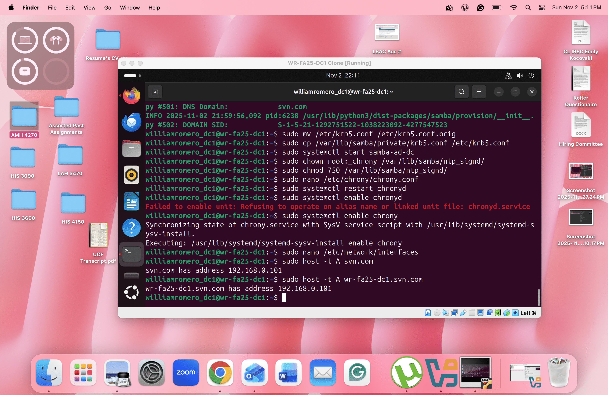
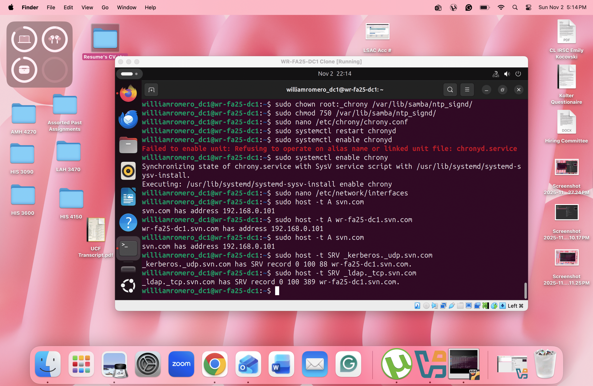
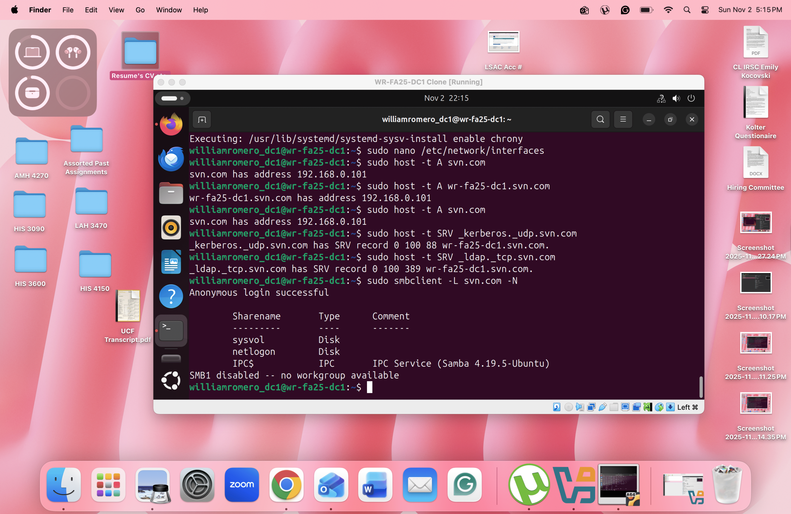
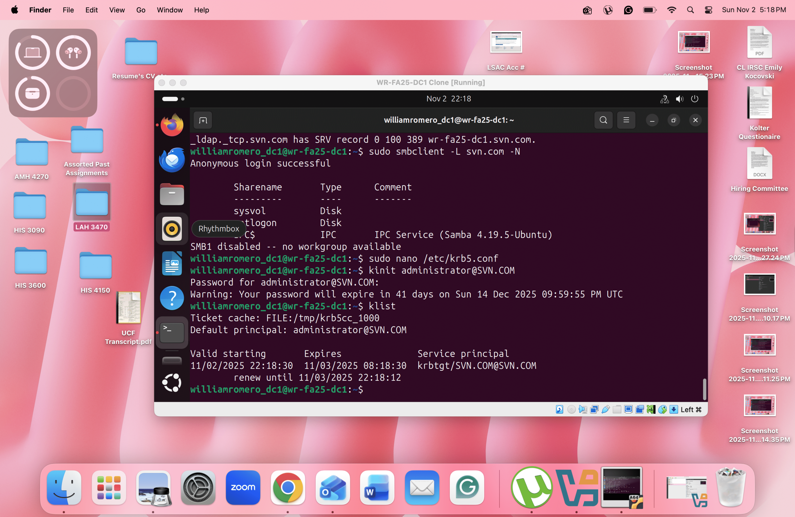
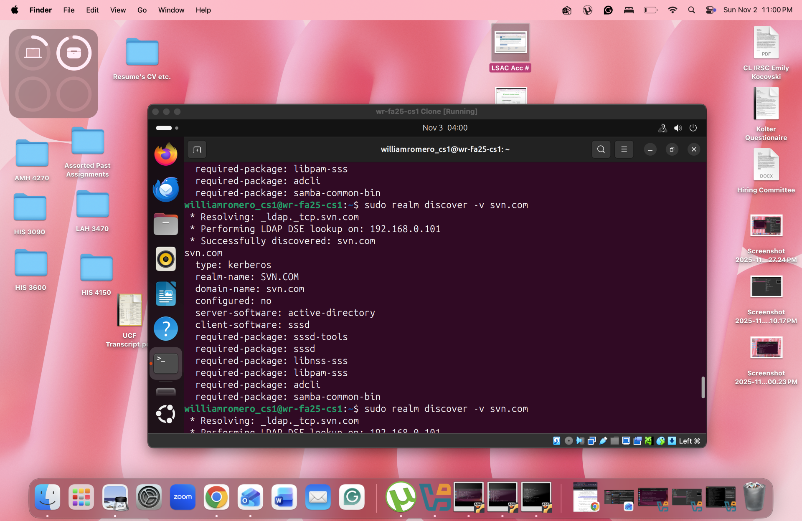
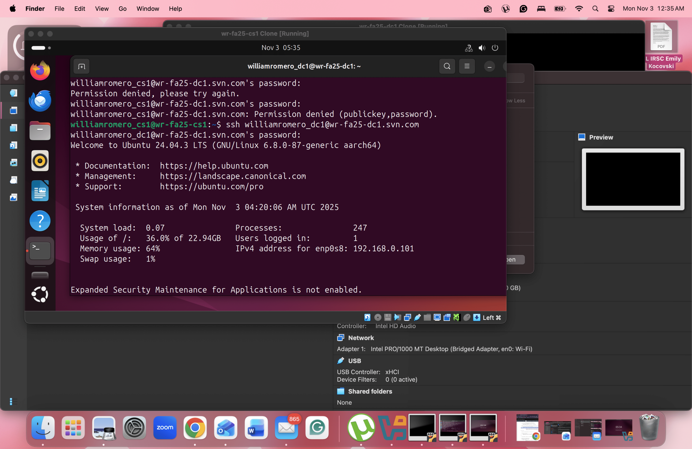

# Linux Active Directory Domain Controller with Samba & Kerberos

A complete Linux-based Active Directory environment implemented using Samba AD, Kerberos, and Ubuntu Server for identity and access management.

## 🎯 Project Overview
This hands-on lab demonstrates the deployment and management of a Linux-based Active Directory environment in a virtualized, multi-server setup. Using Samba AD, Kerberos, DNS, and NTP, I configured a domain controller to simulate enterprise-level identity and access management. The project emphasized security best practices, including least-privilege access, automated administration via Bash and PowerShell scripts, and validation of directory services through structured testing. This lab reflects practical skills in system administration, security hardening, and infrastructure automation — core competencies for roles in cybersecurity, IT operations, and cloud administration.
## 📋 Architecture

```
                    ┌─────────────────────────────────────┐
                    │         SVN.COM Domain              │
                    │        192.168.0.0/24 Network       │
                    └──────────────────┬──────────────────┘
                                       │
                    ┌──────────────────┼──────────────────┐
                    │                  │                  │
           ┌────────▼────────┐ ┌──────▼──────┐ ┌─────────▼────────┐
           │   DC1           │ │    CS1      │ │       CS2        │
           │ 192.168.0.101   │ │192.168.0.102│ │   192.168.0.103  │
           ├─────────────────┤ ├─────────────┤ ├──────────────────┤
           │ • Samba AD DC   │ │ • Domain    │ │ • Domain Joined  │
           │ • Kerberos KDC  │ │   Joined    │ │ • SSSD Configured│
           │ • DNS Server    │ │ • SSSD Auth │ │ • Kerberos Client│
           │ • NTP Server    │ │ • Kerberos  │ └──────────────────┘
           └─────────────────┘ │   Client    │
                               └─────────────┘
```
## 🛠️ Technologies Used
- Ubuntu Server 24.04 - Base operating system
- Samba 4 - Active Directory Domain Services
- Kerberos 5 - Network authentication protocol
- SSSD - System Security Services Daemon
- Chrony - NTP time synchronization
- Bash/PowerShell - Automation and scripting
- VirtualBox - Virtualization platform
- SSH - Secure remote administration

## 📸 Project Evidence

### 1. Active Directory DNS Service Verification

*Active Directory-integrated DNS server resolving both the domain ("svn.com") and domain controller FQDN ("as-sp25-dc1.svn.com") to IP address 192.168.0.101 - Critical for client discovery and authentication*

### 2. Kerberos & LDAP Service Discovery

*DNS SRV records confirming Kerberos Key Distribution Center (KDC) on port 88 and Lightweight Directory Access Protocol (LDAP) service on port 389 - Essential for client authentication and directory queries*

### 3. Active Directory SYSVOL & Netlogon Share Verification

*Critical Active Directory file shares verified: SYSVOL for Group Policy Object distribution and Netlogon for centralized login scripts - Essential for Windows client compatibility and enterprise policy management*

### 4. Kerberos Authentication Success

*Domain administrator successfully obtaining Kerberos Ticket-Granting Ticket (TGT) with 10-hour validity - Confirming Active Directory single sign-on capabilities for enterprise authentication*

### 5. Client-Side Active Directory Domain Discovery

*Client server successfully discovering the Active Directory domain via DNS-based realm discovery - Confirming network connectivity and DNS configuration before domain join attempt*

### 6. Active Directory Computer Account Inventory

*Comprehensive verification of fully functional Active Directory environment - All services operational, clients joined, authentication working*

## ⚙️ Implementation Commands

### 🖥️ Domain Controller Configuration
*Installation and provisioning of Samba 4 Active Directory Domain Services*

```bash
# Install required packages
sudo apt install -y samba-ad-dc krb5-config krb5-user winbind

# Provision Active Directory domain
sudo samba-tool domain provision --realm=SVN.COM --domain=SVN --server-role=dc

# Configure and start services
sudo systemctl start samba-ad-dc
sudo systemctl enable samba-ad-dc
```
## 🚹 Client Server Domain Join
```bash
# Install domain join packages
sudo apt install -y sssd-ad realmd adcli

# Discover and join domain
realm discover svn.com
sudo realm join -v SVN.COM

# Configure authentication services
sudo systemctl restart sssd
sudo pam-auth-update --enable mkhomedir
```
## ✅ Service Verification
```bash
host -t A svn.com
host -t SRV _kerberos._udp.svn.com
kinit administrator@SVN.COM
klist
smbclient -L svn.com -N
realm list
sudo samba-tool computer list
```
🎓 Skills Demonstrated

-Active Directory Services - Linux-based AD DC deployment and management

-Identity & Access Management - Kerberos authentication, SSSD integration

-Network Services - DNS, NTP, and service discovery configuration

-System Administration - Multi-server virtualization and management

-Security Implementation - Least privilege, secure remote access (SSH)

-Enterprise Operations - Group Policy preparation, centralized authentication

-Troubleshooting - Service validation and connectivity testing

